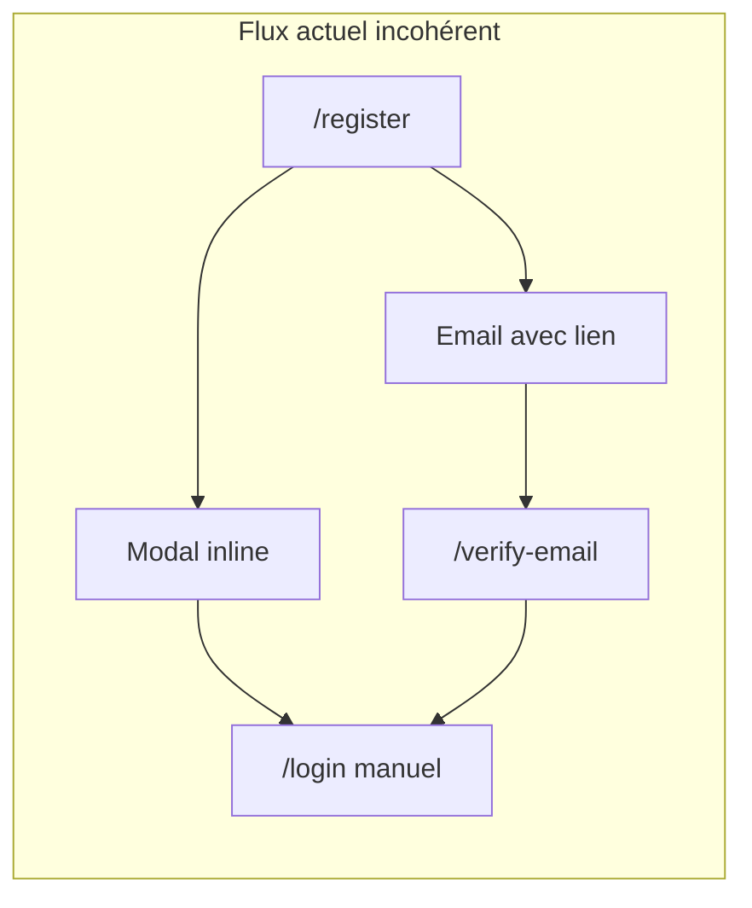
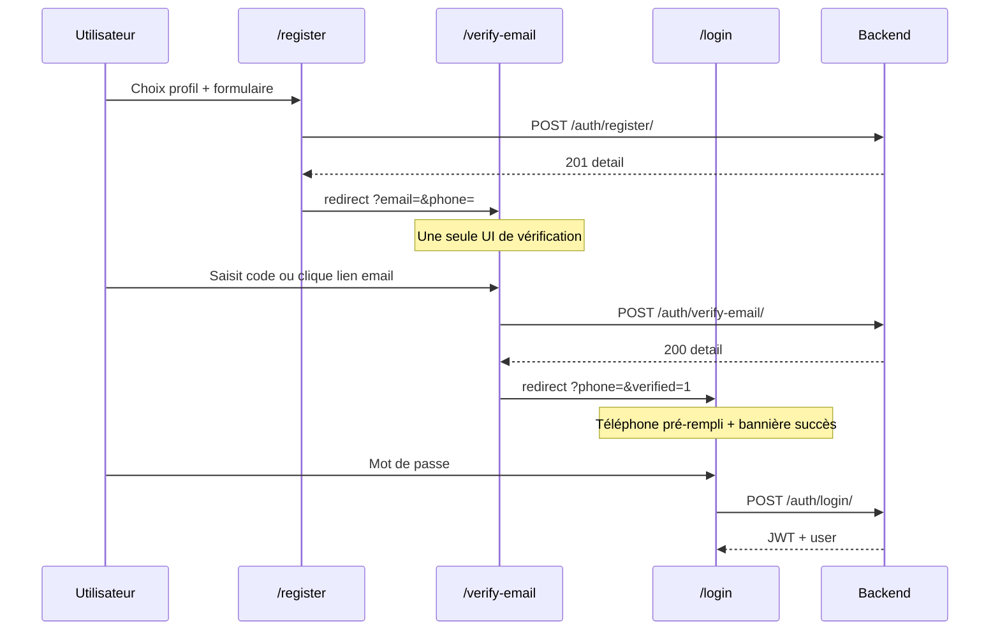

# Correction du flux d'inscription incohérent

## Diagnostic

Le flux actuel est fonctionnel mais fragmenté en plusieurs chemins parallèles qui créent de la confusion :



| Problème | Impact |
|----------|--------|
| **Double UI de vérification** — modal sur `/register` + page `/verify-email` pour le lien email | L'utilisateur qui clique l'email quitte le flux modal ; deux expériences différentes pour la même action |
| **Inscription centrée sur l'email, connexion sur le téléphone** | Après vérification, l'utilisateur ne sait pas avec quoi se connecter |
| **Données manager perdues** | Le frontend envoie `location: pickupAddress` mais [`RegisterView`](backend/api/auth_views.py) ne crée que `Producer` — jamais de `PickupPoint` |
| **Pas de chemin de récupération depuis `/login`** | Erreur 403 "Vérifiez votre email" sans lien vers la vérification |
| **Messages d'erreur mixtes EN/FR** côté backend | UX incohérente (ex. `"phone and password are required."`) |
| **Validation mot de passe asymétrique** | `minlength="8"` sur reset-password, rien à l'inscription, rien côté backend |
| **`is_active` non vérifié au login** | Comptes désactivés peuvent se connecter |
| **`AuthService.register()` inutilisé** | Register appelle `ApiService` directement, logique auth dispersée |

**Hors scope direct** (mentionné mais non prioritaire) : `consumerGuard` redirige les visiteurs non connectés vers `/login` au lieu de permettre la navigation invité sur `/boutique-desktop`.

---

## Flux cible unifié



---

## 1. Backend — [`backend/api/auth_views.py`](backend/api/auth_views.py)

### 1a. Persister le point de retrait pour les managers

Dans `RegisterView`, après création du `User` avec `role == 'manager'` :

```python
if role == 'manager':
    pickup_name = request.data.get('pickup_point_name') or f'Point {full_name}'
    pickup_address = request.data.get('pickup_address') or request.data.get('location') or ''
    pickup_city = request.data.get('pickup_city') or 'Antananarivo'
    if not pickup_address:
        return Response({'detail': 'L\'adresse du point de retrait est requise.'}, status=400)
    PickupPoint.objects.create(
        name=pickup_name,
        address=pickup_address,
        city=pickup_city,
        manager_user=user,
    )
```

Importer `PickupPoint` depuis `models.py`.

### 1b. Harmoniser les messages en français

Remplacer les messages anglais restants dans `PhoneTokenObtainView` et `RegisterView` :

- `"phone and password are required."` → `"Le numéro de téléphone et le mot de passe sont requis."`
- `"No active account found with the given credentials"` → `"Numéro de téléphone ou mot de passe incorrect."`
- `"phone, email, password and full_name are required."` → `"Le téléphone, l'email, le mot de passe et le nom complet sont requis."`

### 1c. Validation mot de passe (register + reset)

Ajouter une fonction utilitaire `validate_password_strength(password)` (min. 8 caractères) appelée dans `RegisterView` et `PasswordResetConfirmView` :

```python
if len(password) < 8:
    return Response({'detail': 'Le mot de passe doit contenir au moins 8 caractères.'}, status=400)
```

### 1d. Vérifier `is_active` au login

Dans `PhoneTokenObtainView`, avant la vérification email :

```python
if not user.is_active:
    return Response({'detail': 'Ce compte a été désactivé.'}, status=403)
```

### 1e. Enrichir la réponse 403 email non vérifié

Retourner un code actionnable pour le frontend :

```python
return Response({
    'detail': 'Veuillez vérifier votre adresse email avant de vous connecter.',
    'code': 'email_not_verified',
    'email': user.email,
}, status=403)
```

---

## 2. Frontend — Unification UX

### 2a. Supprimer la modal de vérification sur [`register.ts`](Frontend/tantsaha-frontend/src/app/components/register/register.ts) / [`register.html`](Frontend/tantsaha-frontend/src/app/components/register/register.html)

Après succès de l'inscription, **rediriger** vers la page unique de vérification :

```typescript
this.router.navigate(['/verify-email'], {
  queryParams: { email: this.email.trim(), phone: this.phone.trim(), from: 'register' }
});
```

Supprimer : `showVerificationPopup`, `verificationCode`, `verifyRegistrationCode()`, `resendVerificationCode()`, `goToLogin()`, et tout le bloc modal HTML (lignes 232–297 de `register.html`).

### 2b. Enrichir [`verify-email.ts`](Frontend/tantsaha-frontend/src/app/components/verify-email/verify-email.ts)

- Lire `phone` et `from` depuis les query params
- Si `from=register`, afficher un bandeau : *"Compte créé — saisissez le code envoyé à votre email"*
- Après vérification réussie, rediriger vers login avec téléphone pré-rempli :

```typescript
this.router.navigate(['/login'], {
  queryParams: { phone: this.phone, verified: '1' }
});
```

- Conserver l'auto-vérification via lien email (`?email=&code=`) — comportement existant
- Ajouter hint post-succès : *"Connectez-vous avec votre numéro de téléphone"*

### 2c. Améliorer [`login.ts`](Frontend/tantsaha-frontend/src/app/components/login/login.ts) / [`login.html`](Frontend/tantsaha-frontend/src/app/components/login/login.html)

- Lire `phone` et `verified` depuis query params dans `ngOnInit`
- Si `verified=1` : afficher bannière verte de succès
- Si erreur 403 avec `code === 'email_not_verified'` : afficher message + lien vers `/verify-email?email=...` + bouton "Renvoyer le code"
- Ajouter sous le champ téléphone un rappel discret : *"Utilisez le numéro saisi lors de l'inscription"*

### 2d. Formulaire manager — [`register.html`](Frontend/tantsaha-frontend/src/app/components/register/register.html)

Remplacer le seul champ `pickupAddress` par 3 champs alignés sur le modèle `PickupPoint` :

| Champ UI | Clé API |
|----------|---------|
| Nom du point de retrait | `pickup_point_name` |
| Adresse / Hangar | `pickup_address` |
| Ville | `pickup_city` |

Mettre à jour le payload dans `register.ts` en conséquence.

### 2e. Validation mot de passe à l'inscription

Ajouter `minlength="8"` sur les champs password/confirmPassword dans `register.html`, avec message d'aide cohérent avec reset-password.

### 2f. Redirection si déjà connecté

Dans `register.ts` `ngOnInit`, reprendre la logique de `login.ts` : si `currentUser` existe, rediriger via `authService.getDefaultRouteAfterAuth()`.

### 2g. Centraliser dans [`auth.service.ts`](Frontend/tantsaha-frontend/src/app/services/auth.service.ts)

- Étendre `User` avec `is_email_verified?: boolean` (stocké depuis la réponse login)
- Ajouter méthodes `verifyEmail()` et `resendVerificationCode()` qui délèguent à `ApiService`
- Faire appeler `authService.register()` depuis `Register` (au lieu de `ApiService` direct)
- Faire appeler `authService.verifyEmail()` / `resendVerificationCode()` depuis `VerifyEmail`

---

## 3. Email template — [`verify_email.html`](backend/api/templates/emails/verify_email.html)

Ajouter une ligne explicite dans le corps du mail :

> *Après vérification, connectez-vous avec votre **numéro de téléphone** (pas votre email).*

Cela aligne le message email avec le formulaire de login.

---

## Fichiers impactés

| Fichier | Changement |
|---------|------------|
| [`backend/api/auth_views.py`](backend/api/auth_views.py) | Manager PickupPoint, validation, messages FR, is_active, 403 enrichi |
| [`backend/api/templates/emails/verify_email.html`](backend/api/templates/emails/verify_email.html) | Rappel connexion par téléphone |
| [`Frontend/.../register/register.ts`](Frontend/tantsaha-frontend/src/app/components/register/register.ts) | Redirect verify-email, champs manager, redirect si connecté |
| [`Frontend/.../register/register.html`](Frontend/tantsaha-frontend/src/app/components/register/register.html) | Champs manager, minlength password, suppression modal |
| [`Frontend/.../verify-email/verify-email.ts`](Frontend/tantsaha-frontend/src/app/components/verify-email/verify-email.ts) | Redirect login post-vérification, bandeau register |
| [`Frontend/.../verify-email/verify-email.html`](Frontend/tantsaha-frontend/src/app/components/verify-email/verify-email.html) | Messages contextuels, hint téléphone |
| [`Frontend/.../login/login.ts`](Frontend/tantsaha-frontend/src/app/components/login/login.ts) | Query params, gestion 403 email non vérifié |
| [`Frontend/.../login/login.html`](Frontend/tantsaha-frontend/src/app/components/login/login.html) | Bannière succès, CTA vérification |
| [`Frontend/.../auth.service.ts`](Frontend/tantsaha-frontend/src/app/services/auth.service.ts) | Méthodes verify/resend, is_email_verified |

---

## Plan de test manuel

1. **Consumer** : register → redirect `/verify-email` → saisir code → redirect `/login?phone=&verified=1` → login OK → dashboard
2. **Lien email** : cliquer le lien dans Mailtrap → auto-vérification sur `/verify-email` → redirect login
3. **Login sans vérification** : tenter login → 403 → CTA vers verify-email visible
4. **Manager** : register avec nom/adresse/ville → vérifier en DB qu'un `pickup_points` row existe avec `manager_user_id`
5. **Producer** : register inchangé, `producers` row créée
6. **Erreurs** : mot de passe &lt; 8 chars refusé ; phone/email dupliqué en français
7. **Resend** : depuis `/verify-email`, renvoyer code → nouveau code reçu
