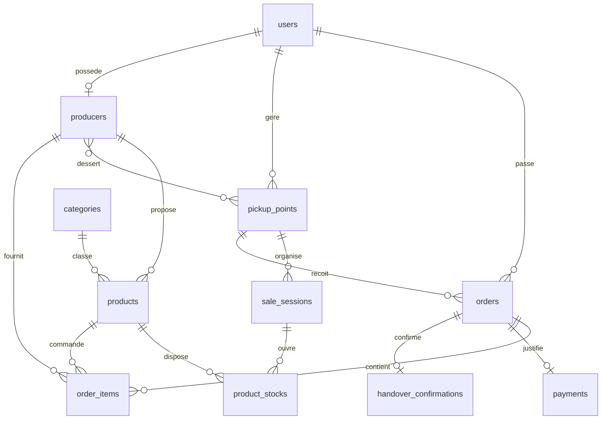

# Conception de la base de donnees PostgreSQL - Tantsaha Connect

## Objectif

Cette conception couvre la premiere version de Tantsaha Connect, une marketplace web ephemere en circuit court. La base de donnees gere les utilisateurs, les producteurs, les points de retrait, les sessions de precommande, les produits, les stocks, les commandes, les preuves de paiement et la validation de remise.

Le SGBD cible est PostgreSQL. Le script executable se trouve dans `database/schema.sql`.

## Entites principales

| Entite | Role |
| --- | --- |
| `users` | Compte commun pour consommateurs, producteurs, gestionnaires et administrateurs. |
| `pickup_points` | Points physiques ou les consommateurs recuperent les commandes. |
| `producers` | Profil metier d'un producteur rattache a un compte utilisateur. |
| `producer_pickup_points` | Association entre producteurs et points de retrait. |
| `categories` | Classement simple des produits. |
| `products` | Catalogue des produits proposes par les producteurs. |
| `sale_sessions` | Fenetres de precommande liees a un point de retrait. |
| `product_stocks` | Quantites disponibles et reservees par produit et session. |
| `orders` | Commandes passees par les consommateurs. |
| `order_items` | Lignes de commande, permettant le multi-producteur. |
| `payments` | Preuves de paiement Mobile Money. |
| `handover_confirmations` | Validation de remise physique des colis. |

## Relations

- Un utilisateur a un role unique : `consumer`, `producer`, `manager` ou `admin`.
- Un consommateur peut etre rattache a un point de retrait par defaut via `users.default_pickup_point_id`.
- Un point de retrait peut avoir un gestionnaire via `pickup_points.manager_user_id`.
- Un producteur est lie a un compte utilisateur via `producers.user_id`.
- Un producteur peut desservir plusieurs points de retrait, et un point peut regrouper plusieurs producteurs via `producer_pickup_points`.
- Une session de vente appartient a un point de retrait.
- Un stock est defini pour un produit dans une session precise.
- Une commande appartient a un consommateur, une session et un point de retrait.
- Une commande contient une ou plusieurs lignes, chacune reliee a un produit et a son producteur.
- Une commande peut avoir une preuve de paiement unique.
- Une commande peut avoir une confirmation de remise unique.

## MCD logique



## MLD relationnel

- `users(id, full_name, phone, email, password_hash, role, default_pickup_point_id, is_active, created_at, updated_at)`
- `pickup_points(id, name, address, city, manager_user_id, distribution_notes, created_at, updated_at)`
- `producers(id, user_id, farm_name, location, description, created_at, updated_at)`
- `producer_pickup_points(producer_id, pickup_point_id, created_at)`
- `categories(id, name, description, created_at, updated_at)`
- `products(id, producer_id, category_id, name, description, unit, unit_price, is_active, created_at, updated_at)`
- `sale_sessions(id, pickup_point_id, opens_at, closes_at, pickup_date, status, created_at, updated_at)`
- `product_stocks(id, product_id, sale_session_id, available_quantity, reserved_quantity, created_at, updated_at)`
- `orders(id, transaction_code, consumer_user_id, pickup_point_id, sale_session_id, total_amount, status, created_at, updated_at)`
- `order_items(id, order_id, product_id, producer_id, quantity, unit_price, line_total, created_at)`
- `payments(id, order_id, method, proof_file_path, verification_status, verified_by_user_id, verified_at, created_at, updated_at)`
- `handover_confirmations(id, order_id, manager_user_id, handed_over_at, notes, created_at)`

## Regles de gestion traduites en base

- Les identifiants primaires sont des UUID generes par `gen_random_uuid()`.
- Les statuts metier sont controles par des types ENUM PostgreSQL.
- Les prix et quantites ne peuvent pas etre negatifs.
- Une quantite reservee ne peut pas depasser la quantite disponible.
- Une session doit avoir `opens_at < closes_at`.
- La date de retrait doit etre posterieure ou egale a la date de fermeture.
- `orders.transaction_code` est unique et genere automatiquement s'il n'est pas fourni.
- `orders.total_amount` est recalcule automatiquement depuis `order_items`.
- Une commande ne peut pointer que vers le point de retrait de sa session.
- Une ligne de commande ne peut associer un produit qu'a son vrai producteur.
- La creation d'une confirmation de remise passe automatiquement la commande a `picked_up`.
- L'ajout ou la mise à jour d'un paiement modifie automatiquement le statut de la commande (`payment_submitted`, `confirmed`, `pending_payment`).
- L'ajout, la modification ou la suppression d'une ligne de commande (`order_items`) met à jour automatiquement la `reserved_quantity` dans `product_stocks`.
- L'annulation d'une commande libère automatiquement le stock réservé correspondant.
- Les preuves de paiement stockent le chemin du fichier, pas le fichier lui-meme.

## Vues metier

### `unified_shop_view`

Cette vue sert a construire la boutique unifiee. Elle regroupe les produits actifs des producteurs rattaches au point de retrait d'une session, avec le stock restant disponible.

Utilisation typique :

```sql
SELECT *
FROM unified_shop_view
WHERE sale_session_status = 'open'
  AND pickup_point_id = '<pickup_point_uuid>'
  AND remaining_quantity > 0;
```

### `harvest_sheet_view`

Cette vue represente la feuille de recolte numerique. Elle additionne les quantites commandees par session, point de retrait, producteur et produit.

Utilisation typique :

```sql
SELECT *
FROM harvest_sheet_view
WHERE sale_session_id = '<sale_session_uuid>'
  AND producer_id = '<producer_uuid>';
```

## Scenarios de test

### Preparation
- Creer un consommateur, un producteur, un gestionnaire et un administrateur.
- Creer un point de retrait et y rattacher le gestionnaire via `pickup_points.manager_user_id`.
- Creer un enregistrement `producers` rattache au compte producteur, et l'associer au point de retrait via `producer_pickup_points`.
- Creer des categories, des produits (`is_active = TRUE`) et des entrees `product_stocks` pour une session en statut `open`.

### Boutique unifiee
- Verifier que `unified_shop_view` retourne uniquement les produits actifs avec `remaining_quantity > 0` pour une session `open`.

### Commande et stock (trigger automatique)
- Creer une commande et y inserer des lignes dans `order_items`.
- Verifier que `product_stocks.reserved_quantity` a ete incremente automatiquement (trigger `trg_order_items_update_stocks`).
- Verifier que `orders.total_amount` a ete recalcule automatiquement (trigger `trg_order_items_sync_total`).
- Verifier que `orders.transaction_code` a ete genere automatiquement au format `TC-YYYYMMDD-XXXXXXXX` (trigger `trg_orders_transaction_code`).

### Paiement et transitions de statut (trigger automatique)
- Inserer un enregistrement dans `payments` avec `verification_status = 'pending'`.
- Verifier que `orders.status` est passe automatiquement a `payment_submitted` (trigger `trg_payments_update_order_status`).
- Mettre a jour `payments.verification_status` a `accepted`.
- Verifier que `orders.status` est passe automatiquement a `confirmed` (meme trigger).
- Verifier que la commande apparait dans `harvest_sheet_view`.
- Tester le rejet : mettre `verification_status` a `rejected` et verifier que `orders.status` repasse a `pending_payment`.
- Tester la soumission d'une nouvelle preuve : modifier `proof_file_path` -> verifier que `verification_status` repasse a `pending` et le statut commande a `payment_submitted`.

### Annulation et liberation du stock (trigger automatique)
- Mettre `orders.status` a `cancelled`.
- Verifier que `product_stocks.reserved_quantity` a ete decremente automatiquement (trigger `trg_orders_release_stock_on_cancel`).

### Remise physique (trigger automatique)
- Avec une commande en statut `confirmed`, inserer un enregistrement dans `handover_confirmations`.
- Verifier que `orders.status` est passe automatiquement a `picked_up` (trigger `trg_handover_confirmations_mark_picked_up`).
- Verifier qu'une deuxieme tentative de remise est bloquee (contrainte UNIQUE sur `handover_confirmations.order_id`).

## Triggers de la base de donnees

| Trigger | Table | Evenement | Comportement |
| --- | --- | --- | --- |
| `trg_orders_transaction_code` | `orders` | BEFORE INSERT | Genere `transaction_code` si absent (`TC-YYYYMMDD-XXXXXXXX`). |
| `trg_order_items_sync_total` | `order_items` | AFTER INSERT/UPDATE/DELETE | Recalcule `orders.total_amount`. |
| `trg_order_items_update_stocks` | `order_items` | AFTER INSERT/UPDATE/DELETE | Incremente ou decremente `product_stocks.reserved_quantity`. |
| `trg_orders_release_stock_on_cancel` | `orders` | AFTER UPDATE | Si `status` passe a `cancelled`, libere le stock reserve. |
| `trg_payments_update_order_status` | `payments` | BEFORE INSERT/UPDATE | Synchronise `orders.status` selon le cycle du paiement. |
| `trg_handover_confirmations_mark_picked_up` | `handover_confirmations` | AFTER INSERT | Passe `orders.status` a `picked_up`. |
| `trg_*_updated_at` | Toutes les tables concernees | BEFORE UPDATE | Met a jour le champ `updated_at`. |

## Notes d'implementation

- Le blocage des achats hors session ouverte doit etre applique cote application, en consultant `sale_sessions.status`, `opens_at` et `closes_at`.
- Le controle de stock lors de la reservation est gere automatiquement de maniere transactionnelle par les triggers de la base de donnees.
- Cependant, pour ameliorer l'experience utilisateur, l'application doit verifier la disponibilite (`available_quantity - reserved_quantity`) avant de soumettre la commande afin d'eviter un rejet par contrainte d'integrite de la base.
- Le fichier de preuve de paiement doit etre valide cote application avant insertion dans `payments`.
- Les roles doivent etre verifies cote application en plus des contraintes de base.
